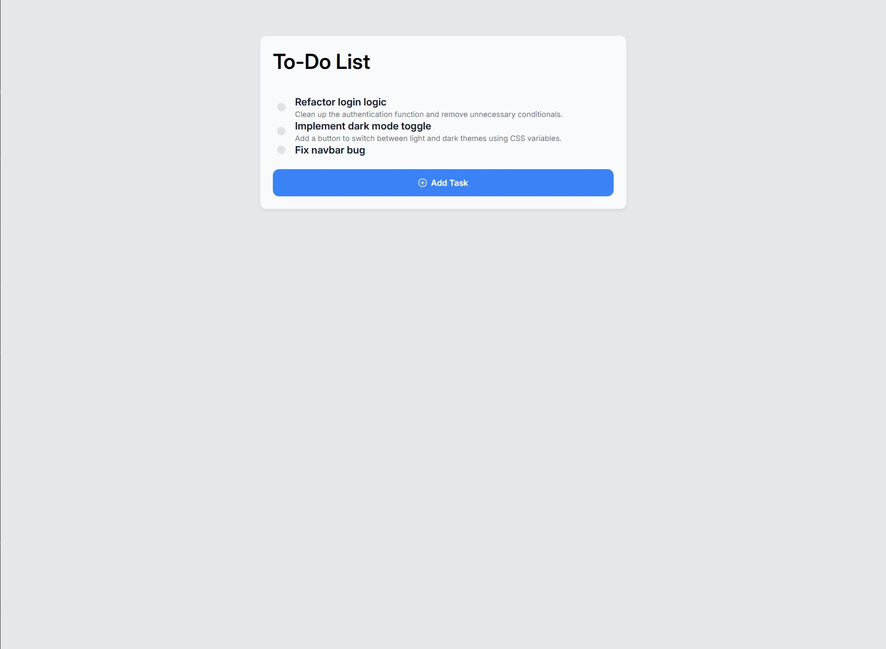
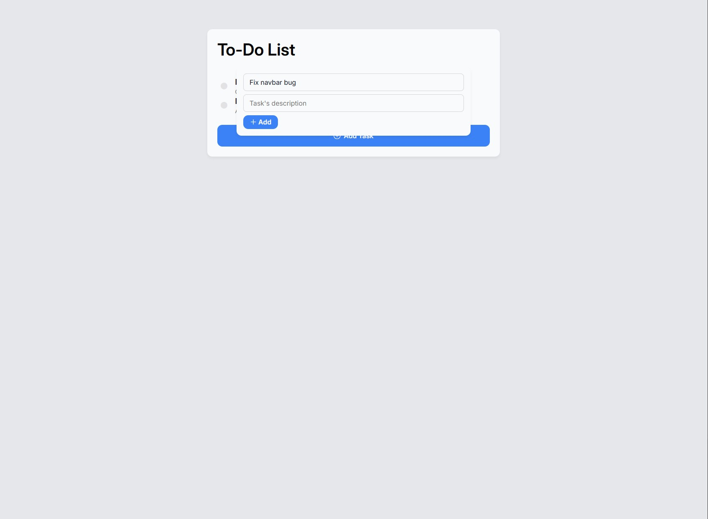
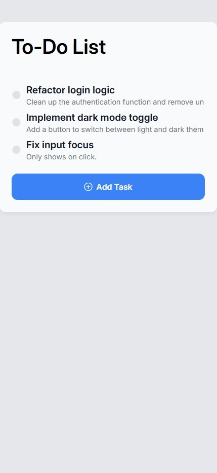
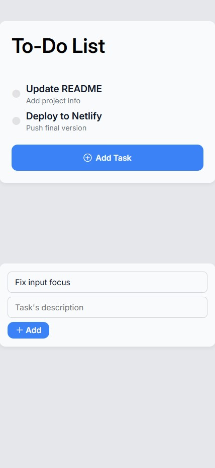

# ✅ To-Do Web App

Este proyecto es una aplicación web de lista de tareas (To-Do List), desarrollada como práctica de **HTML**, **CSS** y **JavaScript** puro. Permite añadir, editar, marcar como realizadas y visualizar tareas con una interfaz limpia y responsive.


## 🚀 Tecnologías utilizadas

- HTML5
- CSS3 (con diseño responsive y uso de variables CSS)
- JavaScript (DOM, eventos, clases)
- Bootstrap Icons


## 📦 Instalación

No necesitas instalar nada para visualizar este proyecto.  
Simplemente clona el repositorio y abre el archivo `index.html` en tu navegador:

```bash
git clone https://github.com/davidrguez98/TO-DO-WEB
```


## 📸 Capturas de pantalla

### 💻 Versión escritorio
  
  

### 📱 Versión móvil
  



## 🎯 Objetivo del proyecto

- Desarrollar una pequeña aplicación funcional usando **JavaScript** orientado a objetos.
- Aplicar estilos responsive mediante **media queries** y CSS modular.
- Usar **interacción dinámica** con el DOM (crear tareas, eliminar, animaciones de estado).
- Organizar bien la estructura del proyecto: separación por carpetas `scripts/` y `style/`.


## 📚 Aprendizajes

- Uso de `addEventListener` y manipulación dinámica del DOM.
- Modularización del CSS con archivos `reset`, `root` (variables) y `style`.
- Control de visibilidad y efectos visuales con clases y eventos.
- Gestión de arrays de objetos y renderizado de componentes HTML con JavaScript.
- Efectos visuales: animación al marcar tarea, `blur` de fondo en el formulario, etc.


## 📁 Estructura del proyecto

```bash
TO-DO-WEB
├── scripts
│   └── scripts.js
├── style
│   ├── reset.css
│   ├── root.css
│   └── style.css
├── screenshots
│   ├── bigsize-1.PNG.jpg
│   ├── bigsize-2.PNG.jpg
│   ├── mobilesize-1.PNG.jpg
│   └── mobilesize-2.PNG.jpg
├── index.html
└── README.md
```


## 📌 Notas

Este proyecto es parte del bootcamp de desarrollo web y se centra tanto en **lógica JS** como en la presentación visual.  
Se han aplicado buenas prácticas de estructura y diseño, y se ha trabajado con estilos modernos y claros.


## 👩‍💻 Contacto

Si quieres ver más proyectos o ponerte en contacto conmigo:

- [GitHub](https://github.com/davidrguez98)
- [LinkedIn](https://www.linkedin.com/in/david-rodr%C3%ADguez-p%C3%A9rez-softdev/)
- Correo: ropeda98@gmail.com

¡Estoy abierto a colaboraciones, feedback o nuevas oportunidades!
